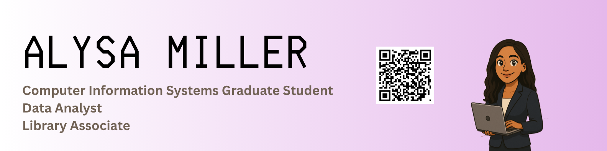

## Hi, I'm Alysa 👩🏽‍💻👋🏽

<!--
**alysamnicole/alysamnicole** is a ✨ _special_ ✨ repository because its `README.md` (this file) appears on your GitHub profile.

Here are some ideas to get you started:

- 🔭 I’m currently working on ...
- 🌱 I’m currently learning ...
- 👯 I’m looking to collaborate on ...
- 🤔 I’m looking for help with ...
- 💬 Ask me about ...
- 📫 How to reach me: ...
- 😄 Pronouns: ...
- ⚡ Fun fact: ...
-->
I am a graduate student at Florida Institute of Technology who is pursuing a Master of Science in Computer Information Systems and passionate about intersecting data with human impact. I have a strong interest in data analytics, business intelligence, and machine learning for business solutions. I have hands-on experience with tools like Python, Java, SQL, Tableau, and Power BI, and I enjoy transforming complex data into meaningful insights that support strategic decisions. My background includes customer-facing roles and technical projects, such as developing dashboards and analyzing real-world datasets, which have helped me build both strong analytical and communication skills. I'm actively seeking opportunities where I can grow as a data analyst and contribute to data-driven teams! 😊
